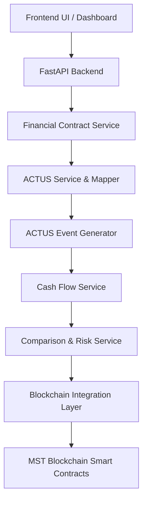
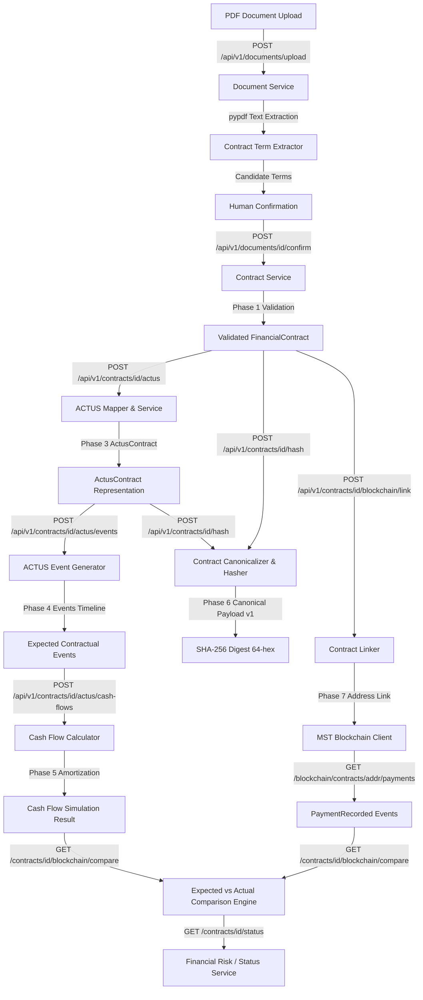

# System Architecture Specification

## Overview

The **ACTUS-Powered Programmable Financial Contracts on MST Blockchain** system links off-chain standardized financial contract logic (ACTUS standard) with on-chain programmable execution on the **MST Blockchain**.

---

## High-Level Architecture Flow

---

## End-to-End System Pipeline (Phase 0 – Phase 8)

---

## Phase 8 Financial Risk / Status Layer Specification

Phase 8 implements a factual, rule-based status and reconciliation layer evaluating off-chain ACTUS payment schedules against on-chain blockchain execution states.

### Key Principles & Features:
1. **Endpoint**: `GET /api/v1/contracts/{contract_id}/status`
2. **Status Definitions (`FinancialStatusEnum`)**:
   - `COMPLETED`: ACTUS financial schedule fully satisfied (`total_actual_paid >= total_expected_amount`, zero unpaid payments, zero overdue payments).
   - `OVERDUE`: Schedule incomplete and at least one expected payment has passed the evaluation date without receipt (`overdue_payment_count > 0`).
   - `DEVIATION_DETECTED`: Schedule incomplete/not overdue, but payment discrepancies exist (underpayments, overpayments, unexpected payments, or payment date shifts).
   - `ON_TRACK`: No overdue payments, no payment deviations, schedule ongoing and on schedule.
3. **On-Chain vs. ACTUS Completion Distinction**:
   - `blockchain_status` (Solidity): Reaches `COMPLETED` when total principal paid reaches `principalAmount` (ignores interest).
   - `overall_status` (ACTUS): Reaches `COMPLETED` only when full principal + interest schedule is satisfied. `blockchain_status = COMPLETED` while `overall_status = DEVIATION_DETECTED` is a valid state when principal is paid but interest remains unpaid.
4. **Overdue vs. Future Unpaid Metrics**:
   - Payments where `actual_payment is None` are split by `expected_date` relative to UTC `evaluation_date`:
     - `expected_date > evaluation_date` $\rightarrow$ `unpaid_payment_count` (future scheduled payments, normal).
     - `expected_date <= evaluation_date` $\rightarrow$ `overdue_payment_count` (past due payments).
5. **Net Amount Variance**:
   - Calculated as `total_actual_paid - total_expected_amount`. Negative values indicate underpayment; positive values indicate overpayment.
6. **Objective & Factual Status Reasons**:
   - Explains status strictly with numeric facts (e.g., `"Actual paid amount is ₹100000.00 versus expected ₹110747.84."`) without subjective risk labels.

---

## Phase 7 Blockchain Integration & Payment Reconciliation Specification

Phase 7 connects off-chain ACTUS contract representations and expected cash flows with Person 2's `FinancialContractV2` smart contract on the MST Blockchain.

### Key Principles & Features:
1. **Client Abstraction (`MSTBlockchainClient`)**:
   - Environment-driven RPC configuration (`MST_RPC_URL`, `MST_CHAIN_ID=91562037`).
   - App startup does not depend on RPC availability.
   - Private keys are strictly protected and never exposed in API responses or logs.
2. **Hash Normalization & Conversion**:
   - Converts Phase 6 64-character lowercase SHA-256 string $\leftrightarrow$ 32-byte Solidity `bytes32`.
   - Endpoint `/hash-verification` compares backend SHA-256 against on-chain `actusHash`.
3. **Monetary Unit Conversion**:
   - Explicit conversion boundary: ₹1.00 = 1 contract accounting unit (`100,000 INR` $\rightarrow$ `100000`).
4. **Expected-vs-Actual Payment Reconciliation**:
   - Chronological matching algorithm pairing expected ACTUS cash flow `#k` with `PaymentRecorded` event log `#k`.
   - Reconciles date variance (days) and amount variance (monetary units).
   - Classifies items as `MATCHED`, `AMOUNT_VARIANCE`, `DATE_VARIANCE`, `UNPAID`, or `UNEXPECTED`.

---

## Phase 6 Contract Hashing & Integrity Verification Specification

Phase 6 creates a deterministic 64-character lowercase hexadecimal **SHA-256 integrity fingerprint** for off-chain contracts to enable future smart contract state anchoring on the MST Blockchain.

### Key Principles & Features:
1. **Canonical Payload Version `v1`**:
   - Explicit allow-list of contractual terms from `FinancialContract` and `ActusContract`.
   - Excludes non-contractual runtime fields (`created_at`, `updated_at`, `cash_flow_id`, `event_id`, database UUIDs).
2. **Deterministic Serialization**:
   - Normalizes Decimal fields (`100000.0` -> `"100000.00"`), dates (`YYYY-MM-DD`), and string casing.
   - Enforces key sorting (`sort_keys=True`), compact separators (`,`, `:`), and UTF-8 byte encoding.
3. **Cryptographic Algorithm**: Standard `hashlib.sha256` produces a 64-character hex digest.
4. **Integrity Verification**: `POST /hash/verify` recalculates the canonical SHA-256 hash from live state and checks for tampering against the stored hash.

---

## Phase 5 Cash-Flow Simulation Specification

Phase 5 converts expected contractual events (`ActusEvent`) into expected monetary cash flows (`CashFlow` & `CashFlowSimulationResult`).

### Key Principles & Features:
1. **Product Support**: Initially supports **ANN** (Annuity) contracts. Unsupported types return `CALCULATION_UNSUPPORTED`.
2. **Stateful Amortization**:
   - Calculates periodic annuity payment (PMT) using exact formulas:
     $$PMT = P \times \frac{r(1+r)^n}{(1+r)^n - 1}$$
   - Tracks opening principal, interest portion ($I_t = P_{t-1} \times r$), principal portion ($PR_t = PMT - I_t$), and closing principal ($P_t = P_{t-1} - PR_t$).
   - Reconciles final maturity payment so `final_outstanding_principal == 0.00`.
3. **Event Combination**: Combines co-occurring `PR` and `IP` events into a single economic payment (`PR_IP`) while maintaining event references.
4. **Sign & Role Conventions**:
   - **RPA** (Lender/Investor): Initial exchange `IED` is an `OUTFLOW` ($-P$), periodic payments are `INFLOW` ($+PMT$).
   - **RPL** (Borrower): Initial exchange `IED` is an `INFLOW` ($+P$), periodic payments are `OUTFLOW` ($-PMT$).
5. **Decimal Precision**: Uses `Decimal` arithmetic with 2-decimal place quantization (`ROUND_HALF_UP`) for display and 0.01 tolerance for zero reconciliation.

---

## Phase 4 ACTUS Event Generation Specification

Phase 4 converts a validated `ActusContract` model into an ordered timeline of **Expected Contractual Events** (`ActusEvent`).

> [!IMPORTANT]
> **Expected Events vs. Actual Payments**: Generated ACTUS events represent expected contractual schedule points (e.g., when interest payments or principal redemptions are contractually due). They are **NOT** actual payment settlements, monetary cash-flow calculations, or blockchain transactions. Monetary cash-flow amounts and amortization engines belong to Phase 5.

### 1. ACTUS Event Types & Semantics

| Event Type | Full Name | Semantic Description | Contract Types Applied |
| :--- | :--- | :--- | :--- |
| **IED** | Initial Exchange Date | Initial principal disbursement/exchange date | `ANN`, `PAM`, `LAM` |
| **IP** | Interest Payment | Periodic scheduled interest payment date | `ANN`, `PAM`, `LAM` |
| **PR** | Principal Redemption | Periodic scheduled principal repayment date | `ANN`, `LAM` |
| **PP** | Principal Prepayment | Unscheduled prepayment event | Generated ONLY if explicit prepayment terms exist |
| **MD** | Maturity Date | Final contract maturity date | `ANN`, `PAM`, `LAM` |

---

### 2. Cycle Date Generation & Calendar Arithmetic

Cycle dates (e.g. `P1M` for monthly cycles) are generated deterministically using calendar month arithmetic (`add_calendar_months`).
- **Calendar Month Rules**: The generator does **NOT** approximate calendar months with 30-day increments.
  - *Example*: A monthly cycle starting on `Jan 31` generates `Feb 28` (or `Feb 29` leap year), `Mar 31`, `Apr 30`, `May 31`.
- **Date Boundaries**: No events are generated past `maturityDate`.

---

### 3. Deterministic Event Ordering Rules

When multiple events occur at the exact same timestamp, events are ordered deterministically by ACTUS priority sequence:
1. `IED` (Priority 1)
2. `PR` (Priority 2)
3. `IP` (Priority 3)
4. `PP` (Priority 4)
5. `MD` (Priority 5)

---

## Architectural Responsibility Boundaries

The system is strictly divided into **Off-Chain** processing and **On-Chain** state management & validation.

### 1. OFF-CHAIN Components (Backend Service Boundary - Person 1)
- **Full Contract Ingestion & Parsing**: Raw contract storage and validation.
- **ACTUS Standard Modeling (Phase 3)**: Formal ACTUS Data Dictionary translation (`ActusContract`).
- **ACTUS Event Generation (Phase 4)**: Generating expected contractual event timelines (`IED`, `IP`, `PR`, `MD`).
- **Cash-Flow Simulation (Phase 5)**: Amortization schedule and cash flow monetary amount calculations.
- **Contract Hashing (Phase 6)**: Cryptographic hashing of canonical contract state for on-chain anchoring.
- **Expected vs. Actual Comparison (Phase 7)**: Reconciling on-chain transactions against off-chain schedules.

---

### 2. ON-CHAIN Components (Smart Contract Boundary - Person 2)
- **Contract Metadata & Hash Anchoring**: Storing immutable contract ID and cryptographic state hash.
- **State Machine & Settlement Events**: Managing on-chain execution, tokenized cash movements, and payment events.
