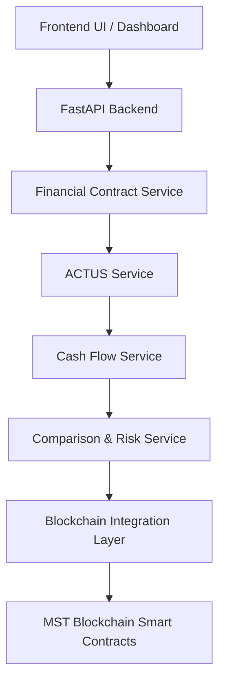

# System Architecture Specification

## Overview

The **ACTUS-Powered Programmable Financial Contracts on MST Blockchain** system links off-chain standardized financial contract logic (ACTUS standard) with on-chain programmable execution on the **MST Blockchain**.

---

## High-Level Architecture Flow



---

## Phase 1 Execution Flow

```mermaid
sequenceFlow
    Client ->> FastAPI Router: POST /api/v1/contracts
    FastAPI Router ->> Pydantic Schema: FinancialContractCreate Schema Validation
    Pydantic Schema ->> Contract Service: Business Logic & Model Normalization
    Contract Service ->> Contract Repository: Save FinancialContract (In-Memory)
    Contract Repository -->> Contract Service: Saved FinancialContract
    Contract Service -->> FastAPI Router: FinancialContractResponse (HTTP 201 Created)
```

### ACTUS Boundary Specification
In **Phase 1**, the `ContractService` validates, normalizes, and stores the raw financial contract input.

In **Phase 2**, the `ContractService` will pass the normalized contract to the **ACTUS Service**, which will map contract attributes into the ACTUS `ANN` (Annuity) Contract Type dictionary model for subsequent contractual event generation.

---

## Architectural Responsibility Boundaries

The system is strictly divided into **Off-Chain** processing and **On-Chain** state management & validation.

### 1. OFF-CHAIN Components (Backend Service Boundary - Person 1)
All complex computational logic, standard financial representations, simulation, and risk calculations reside **Off-Chain** to ensure high performance, cost efficiency, and flexibility:
- **Full Contract Data**: Comprehensive raw financial contract terms and parameters (e.g., initial principal, nominal interest rate, schedule conventions, counterparty details).
- **ACTUS Standard Modeling**: Translation of raw contracts into formal ACTUS Contract Types (e.g., PAM - Principal at Maturity, ANN - Amortizing Loan).
- **Event & Cash-Flow Simulation**: Generation of expected contractual event schedules (e.g., Principal Payment `PP`, Interest Payment `IP`, Principal Redemption `PR`) and expected cash flows over time.
- **Contract Hashing**: Cryptographic hashing (e.g., SHA-256 / Keccak-256) of canonical contract terms to produce a deterministic, immutable state hash for on-chain anchoring.
- **Expected vs. Actual Comparison**: Reconciling expected cash-flow schedules against on-chain transaction history and emitted blockchain events.
- **Risk & Status Evaluation**: Computing contract health indicators (e.g., Performing, Delayed, Defaulted) based on variance analysis.

---

### 2. ON-CHAIN Components (Smart Contract Boundary - Person 2)
The **MST Blockchain** smart contracts enforce immutable state, agreement commitment, and execution triggers:
- **Contract Metadata**: Essential immutable contract properties (e.g., Contract ID, Creator/Counterparty Wallet Addresses).
- **Contract Identifier & Cryptographic Hash**: Anchoring the canonical hash of the off-chain ACTUS contract for integrity verification.
- **Contract State Machine**: Current state of the contract on-chain (e.g., `Initialized`, `Active`, `Matured`, `Defaulted`).
- **Lifecycle & Payment Events**: Emitting on-chain events when scheduled or ad-hoc payments are made through smart contracts.
- **Escrow / Automated Settlements**: Tokenized cash-flow movement and automated execution triggered upon payment verification.

---

## Subsystem Micro-Services Breakdown

1. **API Router Layer**: FastAPI routes providing clean REST API interfaces (`/api/v1/contracts`).
2. **Financial Contract Service**: Ingests, validates, normalizes, and manages contract domain objects.
3. **Contract Repository**: Abstract data access layer (currently in-memory, ready for PostgreSQL migration).
4. **ACTUS Service (Phase 2)**: Translates normalized contracts into ACTUS standard representations.
5. **Cash Flow Simulation Engine (Phase 3)**: Projects future cash-flow schedules.
6. **Comparison & Risk Engine (Phase 4)**: Reconciles on-chain events against off-chain expected cash flows.
7. **Blockchain Integration Adapter (Phase 5)**: Interacts with MST Blockchain smart contracts.
